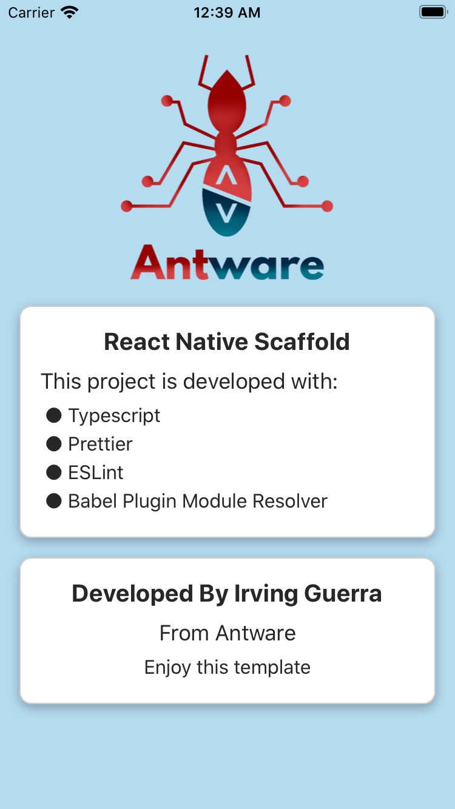

# React Native Scaffold

## Starting 🚀

This is a native reaction initialization and configuration template

### Contents 📋

- Typescript  ✅
- Prettier ✅
- ESLint ✅
- babel-plugin-module-resolver ✅

### Installation 🔧

[git](https://git-scm.com/) s required to run the following console commands:
```sh
$ git clone https://github.com/IrvingGuerra/reactNativeScaffold
```

### Install React Native Rename 💻

With Yarn:

```sh
$ yarn global add react-native-rename
```

With npm:
```sh
$ npm install react-native-rename -g
```

Credits for rename project name: https://github.com/junedomingo/react-native-rename

### Rename Project Name

```sh
npx react-native-rename newName -b com.newName
```


